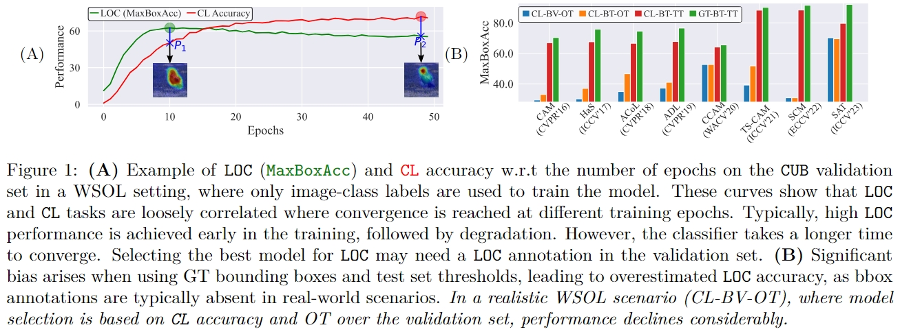

# [A Realistic Protocol for Evaluation of Weakly Supervised Object Localization (WACV2025)](https://arxiv.org/pdf/2404.10034)


by **Shakeeb Murtaza**<sup>1</sup>, **Soufiane Belharbi**<sup>1</sup>, **Marco Pedersoli**<sup>1</sup>, **Eric Granger**<sup>1</sup>


<sup>1</sup>  LIVIA, Dept. of Systems Engineering, ETS Montreal, Canada
<br/>


[](https://arxiv.org/pdf/2404.10034)

<p align="center"></p>


## Abstract
Weakly Supervised Object Localization (WSOL) allows training deep learning models for classification and localization (LOC) using only global class-level labels. The absence of bounding box (bbox) supervision during training raises challenges in the literature for hyper-parameter tuning, model selection, and evaluation. WSOL methods rely on a validation set with bbox annotations for model selection, and a test set with bbox annotations for threshold estimation for producing bboxes from localization maps. This approach, however, is not aligned with the WSOL setting as these annotations are typically unavailable in real-world scenarios. Our initial empirical analysis shows a significant decline in LOC performance when model selection and threshold estimation rely solely on class labels and the image itself, respectively, compared to using manual bbox annotations. This highlights the importance of incorporating bbox labels for optimal model performance. In this paper, a new WSOL evaluation protocol is proposed that provides LOC information without the need for manual bbox annotations. In particular, we generated noisy pseudo-boxes from a pretrained off-the-shelf region proposal method such as Selective Search, CLIP, and RPN for model selection. These bboxes are also employed to estimate the threshold from LOC maps, circumventing the need for test-set bbox annotations. Our experiments with several WSOL methods on ILSVRC and CUB datasets show that using the proposed pseudo-bboxes for validation facilitates the model selection and threshold estimation, with LOC performance comparable to those selected using GT bboxes on the validation set and threshold estimation on the test set. It also outperforms models selected using class-level labels, and then dynamically thresholded based solely on LOC maps.


### Citation:
```
@article{murtaza25realisticproto,
  title={A realistic protocol for evaluation of weakly supervised object localization},
  author={Murtaza, S. and Belharbi, S. and Pedersoli, M. and Granger, E.},
  booktitle={WACV},
  year={2025}
}
```

## Content:
<!-- * [Overview](#overview) -->
* [Requirements](#requirements)
* [Pseudo-Bboxes Annotations](#annon)
* [Download datasets](#datasets)
* [Model Specific Hyperparamters and their range](#hps)
* [Run code](#run)

## <a name="requirements"> Requirements</a>:
See full requirements at [./dependencies/requirements.txt](./dependencies/requirements.txt)

* Python
* [Pytorch](https://github.com/pytorch/pytorch)
* [torchvision](https://github.com/pytorch/vision)
* [Full dependencies](dependencies/requirements.txt)
* Build and install CRF:
    * Install [Swig](http://www.swig.org/index.php)
    * CRF (not used in this work, but it is part of the code.)
```shell
cdir=$(pwd)
cd dlib/crf/crfwrapper/bilateralfilter
swig -python -c++ bilateralfilter.i
python setup.py install
cd $cdir
cd dlib/crf/crfwrapper/colorbilateralfilter
swig -python -c++ colorbilateralfilter.i
python setup.py install
```
## <a name="annon"> Pseudo-Bboxes Annotations</a>:
* For validation, bounding box annotations can be found at:
* Bounding boxes annotation for validation can be used it one run that we produced is available at:
    * Bboxes annotations for **ILSVRC**: [./folds/wsol-done-right-pseduo-splits/metadata_generated_by_selective_search_bboxs/ILSVRC/val](./folds/wsol-done-right-pseduo-splits/metadata_generated_by_selective_search_bboxs/ILSVRC/val)
    * Bboxes annotations for **CUB**: [./folds/wsol-done-right-pseduo-splits/metadata_generated_by_selective_search_bboxs/CUB/val](./folds/wsol-done-right-pseduo-splits/metadata_generated_by_selective_search_bboxs/CUB/val)
* In our code, you can simultaneously input the names and paths of various bounding boxes by utilizing the parameter --metadata_roots_pseduo_boxs_valset (refer to the provided example). The code will perform evaluation and checkpointing for each bounding box set.

## <a name="datasets"> Download datasets</a>:
See [folds/wsol-done-right-splits/dataset-scripts](
folds/wsol-done-right-splits/dataset-scripts). For more details, see
[wsol-done-right](https://github.com/clovaai/wsolevaluation) repo.

You can use these scripts to download the datasets: [cmds](./cmds). Use the
script [_video_ds_ytov2_2.py](./dlib/datasets/_video_ds_ytov2_2.py) to
reformat YTOv2.2.

Once you download the datasets, you need to adjust the paths in
[get_root_wsol_dataset()](dlib/configure/config.py).

## <a name="hps"> Model Specific Hyperparamters and their range</a>:

| Method | Hyperparameter | Sampling Distribution | Range |
|--------|----------------|-----------------------|-------|
| Common HPs | LR, WD, Gamma | LogUniform | [10^-5,10^0] |
|Common HPs  | Step Size | Uniform | CUB: [5-45], ILSVRC: [2-9] |
| CAM, TS-CAM, SCM, NL-CCAM | Common HPs | - | - |
| HaS | Drop Rate, Drop Area | Uniform | [0,1] |
| ACoL | Erasing Threshold | Uniform | [0,1] |
| ADL | Drop Rate, Erasing Threshold | Uniform | [0,1] |
| SAT | Area Threshold | Uniform | [0,1] |


## <a name="run"> Run code</a>: 
To present the WSOL baselines with CAM over CUB using ResNet50, and for other methods by simply replacing the method name and indicating the model-specific parameter as detailed above:
```shell
cudaid=0  # cudaid=$1
export CUDA_VISIBLE_DEVICES=$cudaid
python main_wsol.py \
    --task STD_CL \
    --encoder_name resnet50 \
    --arch STDClassifier \
    --opt__name_optimizer sgd \
    --batch_size 32 \
    --max_epochs 50 \
    --freeze_cl False \
    --support_background True \
    --method CAM \
    --spatial_pooling WGAP \
    --dataset CUB \
    --box_v2_metric False \
    --cudaid 0 \
    --debug_subfolder None \
    --cam_curve_interval 0.001 \
    --exp_id with_gt_and_pseduo_metadata_id_0 \
    --num_workers 2 \
    --opt__lr 0.0001 \
    --opt__weight_decay 1e-05 \
    --opt__step_size 5 \
    --opt__gamma 0.1 \
    --metadata_roots_pseduo_boxs_valset \{\"metadata_by_clip\":\ \"folds/wsol-done-right-pseduo-splits/metadata_generated_by_clip_maps\",\ \"metadata_by_rpn\":\ \"folds/wsol-done-right-pseduo-splits/metadata_generated_by_rpn_bboxs\",\ \"metadata_by_ss\":\ \"folds/wsol-done-right-pseduo-splits/metadata_generated_by_selective_search_bboxs\"\}
```
